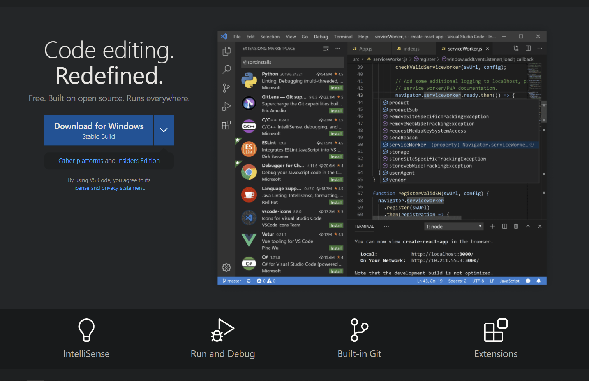
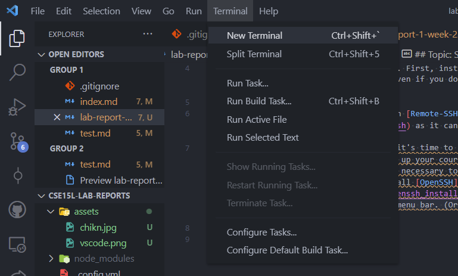
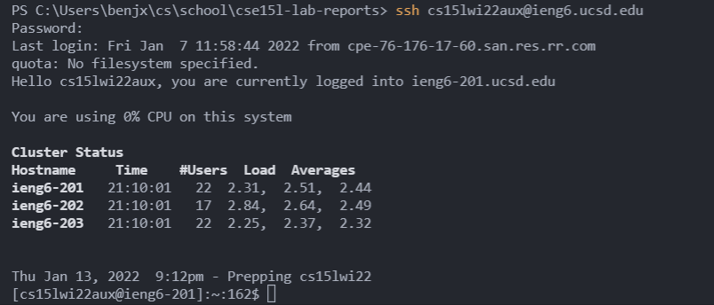
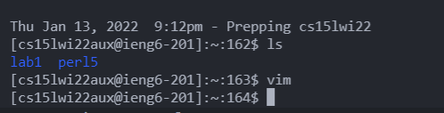
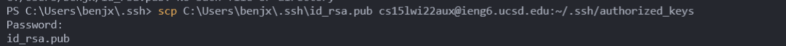
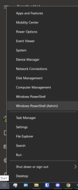
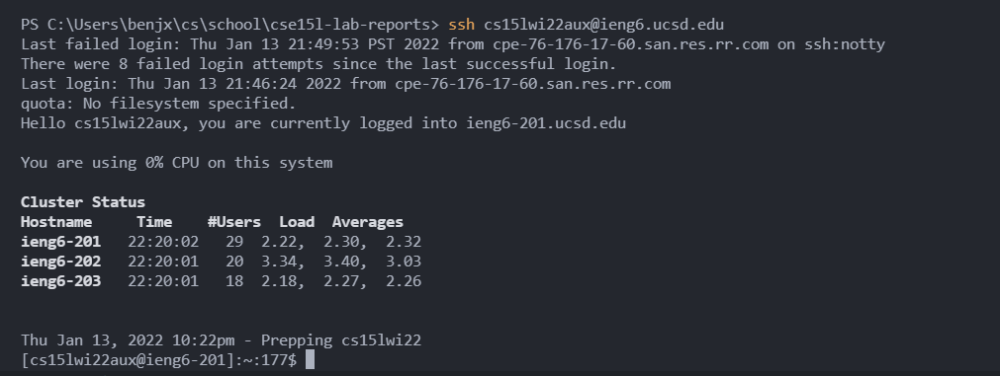
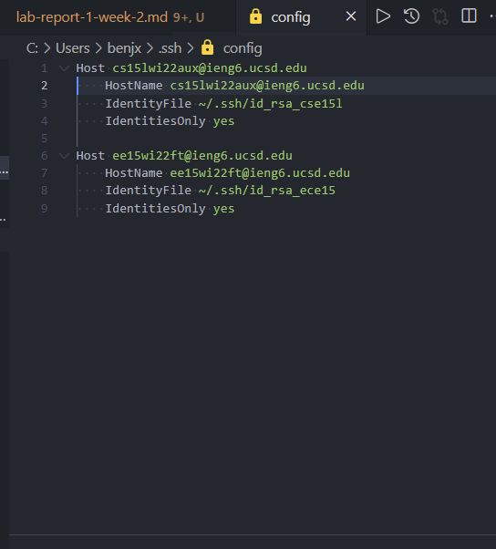
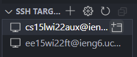

# Lab Report 1: Week 2
## Topic: SSH and Remote Access on UCSD ieng6 Servers. 

## Installation and Setup: Visual Studio Code
1. This step is optional but recommended. First, install [Visual Studio Code](https://code.visualstudio.com/) onto your computer. Even if you don't end up using it much, it's still a good code editor. 

After installation, install the extension [Remote-SSH](https://marketplace.visualstudio.com/items?itemName=ms-vscode-remote.remote-ssh) as it can make the process of SSH'ing into ieng6 servers much faster in step 6. 

## Account and SSH Setup
2. After setting up Visual Studio Code, it's time to set up everything that's needed to connect to the ieng6 servers. First, set up your course-specific account and note your username ex. `cs15lwi22zz` or `ee15wi22zz` [here.](https://sdacs.ucsd.edu/~icc/index.php) Reset the course account's password if it asks you to do so. If you're a Windows user, install [OpenSSH](https://docs.microsoft.com/en-us/windows-server/administration/openssh/openssh_install_firstuse). Next, in Visual Studio Code, open a terminal using via the top menu bar.  (Or any built-in terminals for your operating system).
Then, in your terminal, type `ssh [username]@ieng6.ucsd.edu` ex. `ssh cs15lwi22zz@ieng6lucsd.edu`. After that, type in your password which either already exists or just set up earlier in this step. Note that these passwords and accounts are separate from your Active Directory credentials. 

## Terminal Commands
3. After logging in, try running some commands in the SSH terminal. 
`ls`- Lists files in current directory. 
`vim` - Opens a painful text editor. (Closed it for the screenshot)

## File Transfer
4. To copy files from your local machine to the server, type `scp [filepath] [username]@ieng6.ucsd.edu:~/[path]`

## SSH Keys
5. To speed up the process of SSH'ing and using scp without typing in a password every time, you can set up an ssh key. In your local terminal (NOT IN SSH), type: `ssh-keygen` and just spam enter, but keep note of where the id_rsa files are saved on your computer. Windows users must also turn on ssh-agent and follow the ssh-add instructions [here](https://docs.microsoft.com/en-us/windows-server/administration/openssh/openssh_keymanagement#user-key-generation), make sure to use PowerShell with administrator privileges by right clicking the Windows icon on your task bar like it's an NFT.   
After generating an ssh key, ssh back onto the ieng6 servers and type `mkdir .ssh` in the home directory. Then, logout of ssh and scp id_rsa.pub to the new .ssh folder as authorized_keys. Remember path of id_rsa/id_rsa.pub from ssh-keygen.
ex. `scp C:\Users\Name\.ssh\id_rsa.pub cs15lwi22zz@ieng6.ucsd.edu:~/.ssh/authorized_keys`
Now you should be able to login and scp without a password.

## SSH Configurations
6. Another way to optimize remote running even more is by configuring Visual Studio Code to allow for one-click SSH'ing and directly editing files on ieng6 through Visual Studio Code. To do this, open the remote explorer tab in Visual Studio Code, which we installed in part 1.  
 
Next, click on the gear icon next to SSH targets and select `.\ssh\config`

Open the file and configure it such that it looks like this.   
The Host and HostName should be your course username + ieng6.ucsd.edu. The IdentityFile should be `~/.ssh/id_rsa` (I have it named to my courses so it's easier to keep track of). Now you can be even lazier than people using SSH keys by clicking on window icon to instantly SSH onto ieng6 at the click of a button. 

