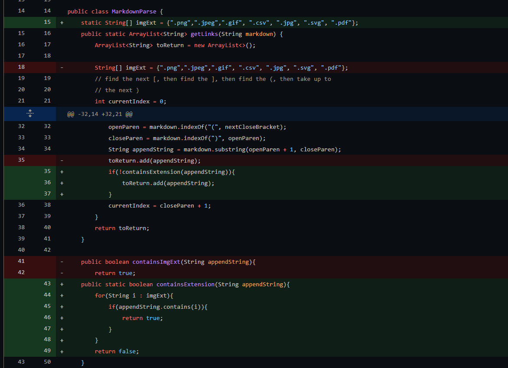

# Lab Report 2: Week 4
## Topic: Debugging Markdown Parse

## Change 1: Filtering Images From Links
The first change we made in Lab 3 was filtering out images from links. 

The test file that led to this change is linked [here](https://github.com/BenX-64/markdown-parse/blob/main/test3-file.md?plain=1). 
  
The symptoms of this bug was images being included in the final list of links in the program's output. 
  
Here, the symptom caused by the failure-inducing input made the bug relatively easy to track down and fix, since the failure inducing input contained an image that was just treated as a link. The bug was that the program recognized images as links because in Markdown since both use square brackets `[]` followed by parentheses `()`. This was fixed by searching for image file extensions such as `.png`, `.jpg`, etc.  within the link, and excluding all "links" that contain these image file extensions.

## Change 2: Ignoring Invalid Syntax and Infinite Loops
The next change we made in Lab 3 was excluding links that were improperly formatted. 
 
The version of the test file that led to this change is linked [here](https://github.com/BenX-64/markdown-parse/blob/main/test4-file.md?plain=1).
 
The symptoms of this bug was the program going backwards and reading the same lines multiple times. 
 
Here, the symptoms showed that the program was treating text that wasn't in a markdown hyperlink, as links, and was somehow looping around. The failure-inducing input also made the symptoms clearer, as the exclusion of anything related to `CSE20.com` showed that some `indexOf()` was returning -1, and making the program read from the beginning of the file again. This made it another easy bug to track down as the bug itself was that the program did not ignore anything not properly formatted as links, so we just made it only consider brackets that were immediately followed by a parentheses so that `indexOf(")")` or `indexOf("(")` wouldn't return -1 and cause the program to read from the start, or start reading text inside parentheses used in text. 

## Change 3: Fixing Infinite Loops
The last major change we made was preventing infinite loops from occuring while parsing,  which simultaneously fixed some test cases, and made future debugging significiantly easier.  
The test files that led to these changes are linked here: [1](https://github.com/BenX-64/markdown-parse/blob/main/test-file8.md?plain=1). [2.](https://github.com/BenX-64/markdown-parse/blob/main/test-file2.md?plain=1) 
 
 
Here, the failure-inducing input was difficult to track down, as there were two different tests that looked completely different from each other that were causing the same symptom. What ended up being the bug, was that the failure-inducing inputs caused the program to think there was another link, so `indexOf("]")` would return -1 and cause the loop to restart from the beginning of the file by resetting currentIndex to `-1 + 1`, with `-1` being what was returned by `indexOf()`, and the `+1` coming from line 63/73, thus leading to the symptom of the infinite loop as currentIndex would be perpetually lower than the length of the file. This was fixed by checking if the updated currentIndex variable is lower than currentIndex at the beginning of the loop, and terminating the loop if it is lower as it would signal that there are no more links in the file. 