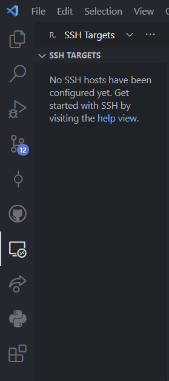
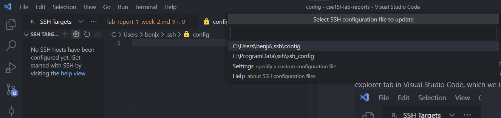
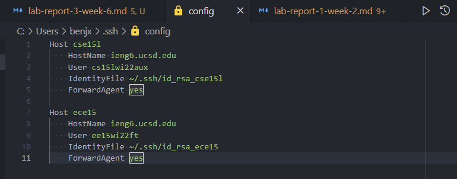
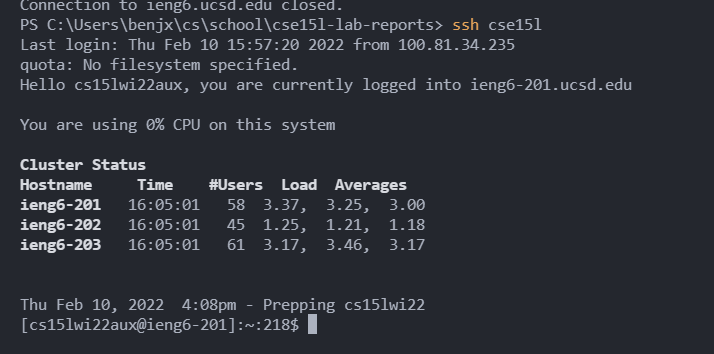
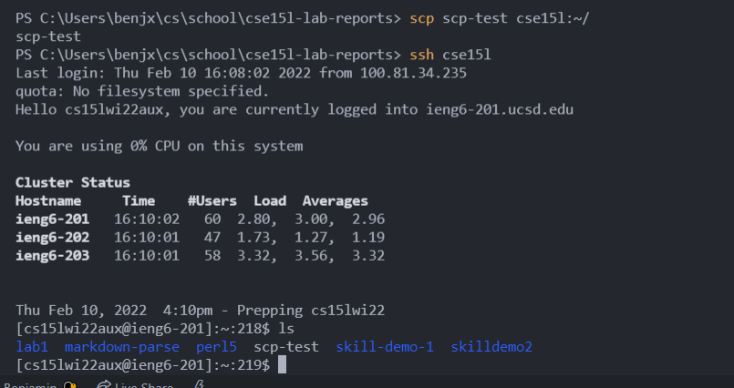

# Lab Report 3: Week 6

## Streamlining SSH configuration
Note: This was partially copied from my week 1 lab report. 

Another way to optimize remote running even more is by configuring Visual Studio Code to allow for one-click SSH'ing. First, navigate to `C:\Users\user.name\.ssh`, or go to the
remote explorer tab in VSCode (Need to install VSCode's SSH extension for this tab). 
 
Next, click on the gear icon next to SSH targets and select `.\ssh\config`

I edited the file through VSCode but it can be done with any text editor   
Now I am able to SSH to ieng6 with the alias I set: `cse15l`.

This also works with ssh.
