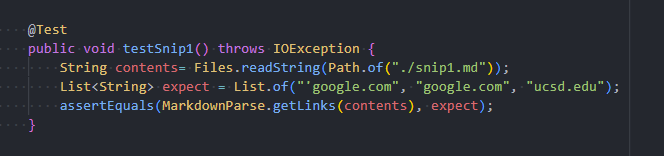
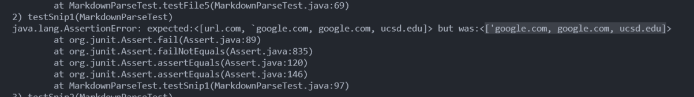
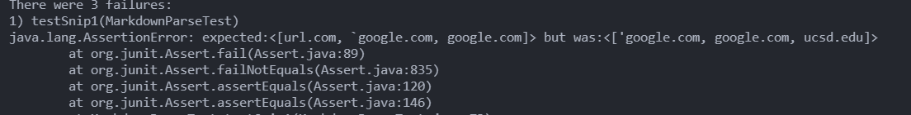
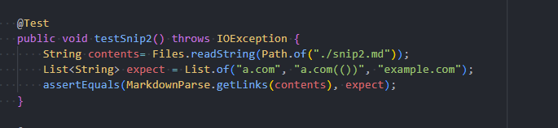
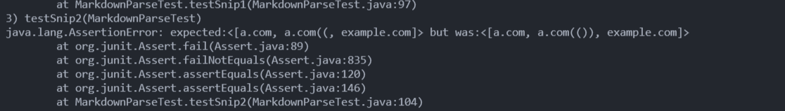
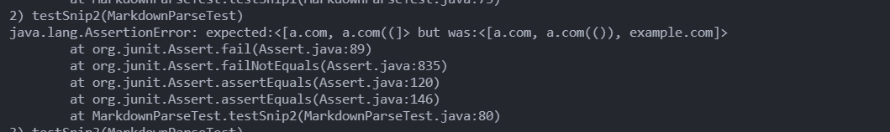
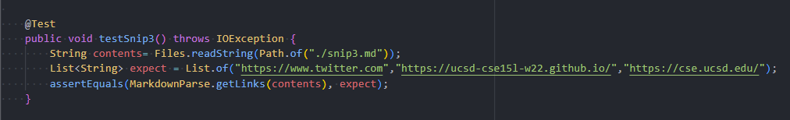
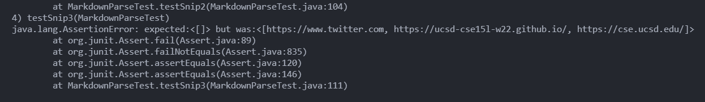
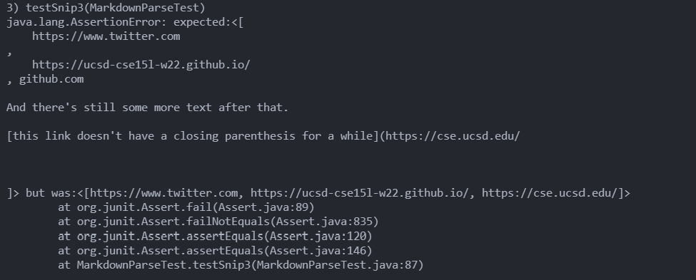

# Lab Report 4: Week 8

## Debugging

[My implementation](https://github.com/BenX-64/markdown-parse)
 
[Reviewed implementation](https://github.com/5ean-github/markdown-parse)
 
All expected values were taken from VSCode preview.
### Snippet 1
Test:  

Expected: `['google.com, google.com, ucsd.edu]`  
My implementation:  

I do not think there is a small code change that could fix this program. I would need to make
MarkdownParse be able to recognize code blocks, which would be about as complicated as finding opening and
closing brackets, which each take a lot of lines to implement.

Reviewed implementation:  

### Snippet 2
Test:  

Expected: `[a.com, a.com(()), example.com]`  
My implementation:  

I do think there is a small code change that could fix this program. Rather than having the program search
directly for the next closing parentheses, I can instead add a method similar to the one in Lab 8 that searches for
the last parentheses (and that method was relatively short if I recall correctly).

Reviewed implementation:  

### Snippet 3
Test:  

Expected: `[https://ucsd-cse15l-w22.github.io/]`  
My Implementation:  

I do think there is a small code change that could fix this program. After playing around with the test file
a little, I noticed that if the program were able to filter out `\n` from the links, everything seems to work perfectly. So a simple string replace within the potentialLink variable should do the trick. 
 

Reviewed implementation:  
