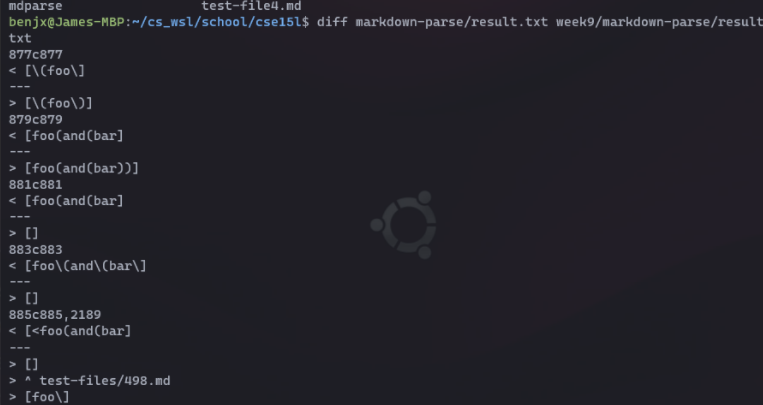
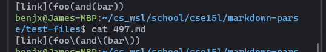
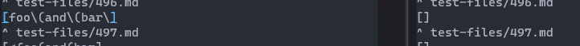
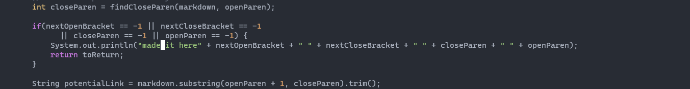
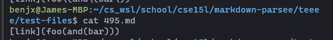
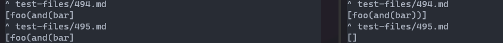
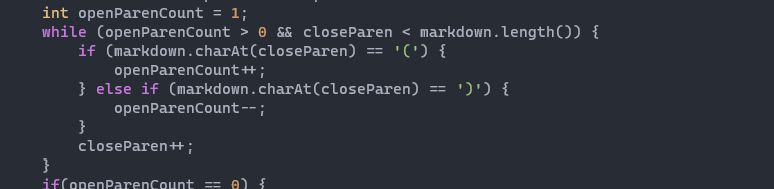

# Lab Report 5: Week 10

## Pretend there's a creative title here
For both of these tests, I found the differences via the `diff` command.  

### Test 1
  
The left half contains the output for my implementatiom, and the right half the provided implementation.
 
  
In this case, I think my implementation is correct as it provides a link when the file does appear to contain a link. 
After tracing the bug, I found that it was because the program was incorrectly terminating because it "failed" to find a closing parentheses after the first opening parentheses.  
 
Here, the reassigning of `closeParen` could've been moved or deleted. Either way it's this line of code that was messing things up. 
  
In this case, the expected output should match my implemention's output. 
### Test 2
  
The left half contains the output for my implementatiom, and the right half the provided implementation.

For the second test that failed, I believe my implementation is correct, and that the expected output should match mine.  
Here, the issue seems to lie with `findCloseParen` with the provided implementation. It incorrectly continues to search for the next closing parentheses when it should terminate after finding the first available.  

